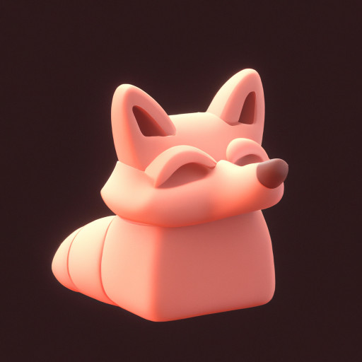

# synergiAI

## jakiś opis parametrów
### Zakładka Model

| Parametr | Opis | Wartości |
|---|---|---|
| Rozmiar kontekstu | Maksymalna długość kontekstu (w tokenach), jaką model może przetwarzać. Większe wartości umożliwiają dłuższe prompty, ale zwiększają zużycie pamięci. | 512-32768 |
| Liczba warstw GPU | Liczba warstw modelu wykonywanych na GPU. Wartość -1 oznacza wszystkie warstwy. | -1 do 100 |
| Liczba wątków CPU | Liczba wątków CPU używanych do obliczenia. Domyślnie używa wszystkich dostępnych wątków. | 1-32 |
| Rozmiar partii | Rozmiar partii dla przetwarzania tokenów. Większe wartości mogą przyspieszyć generowanie, ale zwiększają zużycie pamięci. | 1-2048 |
| Używaj half-precision dla KV cache | Czy używać 16-bitowej precyzji dla pamięci podręcznej key/value. Zmniejsza zużycie pamięci, zwykle bez wpływu na jakość. | Tak/Nie |
| Obliczaj logity dla wszystkich tokenów | Czy obliczać logity dla wszystkich tokenów, nie tylko dla ostatniego. Używane głównie w specyficznych zadaniach. | Tak/Nie |
| Ładuj tylko słownik modelu | Czy ładować tylko słownik tokenizera bez wag modelu. Używane do analizy tokenizacji. | Tak/Nie |
| Używaj memory mapping | Czy używać memory mapping przy ładowaniu modelu. Przyspiesza ładowanie i zmniejsza zużycie pamięci. | Tak/Nie |
| Zablokuj model w RAM | Czy zablokować model w pamięci RAM, aby zapobiec wypchnięciu go na dysk. | Tak/Nie |
| Używaj jako model embeddingu | Czy używać modelu do generowania embeddings zamiast przewidywania tekstu. | Tak/Nie |
| Typ skalowania RoPE | Metoda skalowania RoPE (Rotary Positional Embedding) dla kontekstów dłuższych niż natywny kontekst modelu. | Brak, linear, yarn |
| Bazowa częstotliwość RoPE | Bazowa częstotliwość dla RoPE. | 100.0-100000.0 |
| Skala częstotliwości RoPE | Skala częstotliwości dla RoPE. Używana z typem skalowania RoPE. | 0.1-10.0 |

### Zakładka Generowanie

| Parametr | Opis | Wartości |
|---|---|---|
| Maksymalna liczba tokenów | Maksymalna liczba tokenów do wygenerowania w odpowiedzi. | 1-32768 |
| Temperatura | Kontroluje losowość odpowiedzi. Wyższe wartości dają bardziej różnorodne, ale mniej spójne odpowiedzi. | 0.0-2.0 |
| Top-p (nucleus sampling) | Ogranicza próbkowanie do tokenów o skumulowanym prawdopodobieństwie p. Zmniejsza szanse na generowanie mało prawdopodobnych tokenów. | 0.0-1.0 |
| Top-k | Ogranicza próbkowanie do k najbardziej prawdopodobnych tokenów. Mniejsze wartości dają bardziej deterministyczne odpowiedzi. | 1-100 |
| Kara za powtórzenia | Mnożnik kary za powtarzanie tokenów. Wartości >1.0 zmniejszają powtórzenia. | 0.0-2.0 |
| Kara za obecność | Kara za tokeny już obecne w tekście. Wartości >0.0 zmniejszają powtarzanie. | 0.0-2.0 |
| Kara za częstość | Kara za tokeny występujące często w tekście. Wartości >0.0 zmniejszają powtarzanie popularnych tokenów. | 0.0-2.0 |
| Tryb strumieniowy | Czy wyświetlać generowaną odpowiedź w czasie rzeczywistym, token po tokenie. | Tak/Nie |

### Zakładka Interfejs

| Sekcja | Opis |
|---|---|
| System Prompt | Instrukcja systemowa określająca zachowanie modelu w trybie czatu. |
| Ostatnio używane modele | Lista ostatnio używanych modeli z możliwością szybkiego załadowania. |

## Panel czatu

W panelu czatu można:
- Załadować model
- Wybrać tryb pracy (Chat/Complete)
- Przeglądać historię konwersacji
- Wprowadzać prompty
- Generować odpowiedzi
- Dołączać pliki
- Zapisywać i wczytywać historię

## Panel szczegółów

Panel szczegółów zawiera:
- Listę dołączonych plików
- Pole kontekstu, które można dodać do konwersacji

## Konfiguracja

- Zapisać konfigurację do pliku
- Wczytać konfigurację z pliku
- Ustawić aktualną konfigurację jako domyślną

### Dobór parametrów

1. **Dla ogólnych zastosowań**:
   - Temperatura: 0.7
   - Top-p: 0.95
   - Top-k: 40
   - Kara za powtórzenia: 1.1

2. **Dla bardziej deterministycznych odpowiedzi** (np. kod, logika):
   - Temperatura: 0.2-0.5
   - Top-p: 0.9
   - Top-k: 20-40
   - Kara za powtórzenia: 1.1-1.3

3. **Dla bardziej kreatywnych odpowiedzi**:
   - Temperatura: 0.8-1.2
   - Top-p: 0.95-0.98
   - Top-k: 50-60
   - Kara za powtórzenia: 1.0-1.05

### Wpływ rozmiaru kontekstu

Większy rozmiar kontekstu pozwala na przetwarzanie dłuższych promptów, ale znacząco zwiększa zużycie pamięci. Zalecane wartości:
- 4096: Dla większości przypadków użycia
- 8192: Dla dłuższych konwersacji
- 16384+: Dla bardzo długich dokumentów lub złożonych zadań

### Dołączanie plików - nie wiem jak z PDF,docx itd. dodam next time

Dołączanie plików dodaje ich zawartość do kontekstu konwersacji. Jest to przydatne do:
- Analizy tekstów
- Odpowiadania na pytania dotyczące dokumentów
- Podsumowywania treści
